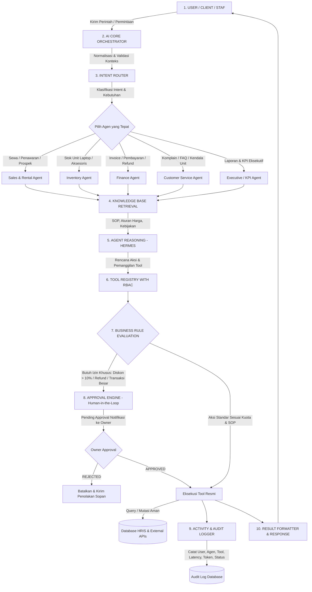

# PRODUCT REQUIREMENT DOCUMENT (PRD)
## Project: ISKOM AI Operating System & Multi-Agent Dashboard (Hermes & OpenCode)

---

## 1. Executive Summary & Vision

### 1.1 Visi Produk
Membangun **AI Operating System (AI-OS) Enterprise** yang terdesentralisasi namun terpusat di bawah kendali Owner, mengorkestrasi seluruh operasional bisnis rental laptop & IT (ISKOM). Sistem ini bukan sekadar chatbot, melainkan sistem multi-agent mandiri yang memproses pekerjaan dari hulu ke hilir (*end-to-end*): mulai dari penangkapan prospek, verifikasi stok unit, kalkulasi penawaran (*quotation*), penagihan invoice, hingga monitoring kepuasan pelanggan dengan kepatuhan penuh terhadap **Business Rules**, **Role-Based Access Control (RBAC)**, dan **Human-in-the-Loop Approval**.

### 1.2 Masalah Bisnis yang Diselesaikan
1. **Bottleneck Manual**: Penawaran harga sewa, pengecekan ketersediaan laptop, dan follow-up customer saat ini memakan waktu staf sales.
2. **Risiko Kesalahan Diskon & Transaksi**: Memberikan diskon atau menyetujui transaksi besar tanpa persetujuan Owner berisiko merugikan finansial perusahaan.
3. **Halusinasi AI Tradisional**: AI umum sering mengarang ketersediaan stok atau harga unit jika tidak diikat dengan aturan ketat (*deterministic rules* & *tool registry*).
4. **Silo Data**: Kebutuhan operasional sewa, data keuangan di HRIS, dan interaksi bot belum terkoordinasi dalam satu audit trail yang transparan.

---

## 2. Arsitektur & Teknologi (Tech Stack)

| Komponen | Teknologi | Peran & Tanggung Jawab |
| :--- | :--- | :--- |
| **Brain / Reasoning LLM** | **Nous Hermes (Hermes 3 / Hermes 2.5 Pro)** | Model reasoning utama dengan kemampuan *structured JSON output* dan *Function Calling* tingkat enterprise. Menjamin AI patuh pada schema tool dan tidak berhalusinasi. |
| **Code Interpreter & Sandbox** | **OpenCode (Open-Interpreter / Sandboxed Runtime)** | Menjalankan kalkulasi sewa dinamis, agregasi laporan keuangan, rekonsiliasi data rental, dan visualisasi grafik secara aman. |
| **Core Orchestrator** | Python 3.11+ (FastAPI / Pydantic V2 / AsyncIO) | Menangani request lifecycle: Session, Intent Routing, Tool Execution, Rule Verification, State Tracking. |
| **Knowledge Engine** | Markdown Vector Store + SQLite/JSON Store | Menyimpan SOP, daftar harga, jaminan sewa (KTP/perusahaan), template pesan, dan FAQ yang dapat di-update tanpa redeploy. |
| **Database & Integrasi** | MySQL (HRIS Database Existing) + SQLite/Postgres (AI State & Audit Log) | Terhubung ke tabel sewa, laptop, invoice, dan user HRIS yang sudah ada. |
| **Frontend Dashboard** | Modern Responsive Web UI (Vanilla/Vue/Tailwind/Glassmorphism) | Dashboard eksekutif Owner & Staff: Live Agent Activity, Approval Queue, Token Usage, Analytics. |

---

## 3. Alur Kerja Inti (Core Workflow Lifecycle)

Setiap request dari user/karyawan/customer melalui 10 tahapan disiplin tanpa jalan pintas:

---

## 4. Spesifikasi Modul Utama

### 4.1 AI Core Router
- **Tujuan**: Menganalisis kalimat input pengguna dan memetakan ke agent yang berwenang.
- **Mekanisme**: Menggunakan model *Hermes Function Calling* dengan *structured system prompt* untuk memilih `agent_id` dan `confidence_score`.
- **Fallback**: Jika intent ambigu atau di luar domain, diarahkan ke CS Agent atau meminta klarifikasi ke pengguna.

### 4.2 Tool Registry & Permission Engine
- Agen dilarang mengakses SQL database secara bebas (*Raw SQL prohibited*).
- Setiap akses data wajib melalui **Tool Terdaftar**:
  - `check_laptop_inventory(specs, qty, start_date, duration_days)`
  - `calculate_rental_pricing(unit_ids, duration_days, customer_type)`
  - `create_rental_quotation(customer_data, items, discount_percent)`
  - `query_invoice_status(invoice_id)`
  - `request_owner_approval(action_type, payload, rationale)`
- Setiap tool terikat pada **Permission Matrix** (Read, Write, Execute, Need_Approval).

### 4.3 Business Rule & Human-in-the-Loop Engine
Engine memeriksa parameter sebelum tool dieksekusi:
1. **Aturan Diskon**:
   - $\le 10\%$: Otomatis disetujui oleh Sales Agent sesuai margin minimum.
   - $> 10\%$: Wajib ditangguhkan (*Pending Approval*) dan dikirim ke dashboard Owner.
2. **Aturan Nilai Transaksi**:
   - Nilai sewa $\ge$ Rp 25.000.000 / jumlah unit $\ge$ 20 unit: Wajib review Owner.
3. **Aturan Refund / Penghapusan Denda**:
   - Wajib persetujuan Finance Head atau Owner.
4. **Anti-Halusinasi & Data Tidak Ditemukan**:
   - Jika stok/data tidak ada di DB, dilarang berspekulasi atau menjanjikan. Wajib menampilkan status eskalasi.
5. **Keamanan (CAPTCHA / OTP / Pembayaran Pihak Ketiga)**:
   - AI dilarang memproses otomatis; wajib meminta intervensi manusia (*Human Intervention Required*).

### 4.4 Audit Trail & Observability
Setiap interaksi mencatat:
- `transaction_id`: UUID unik per request.
- `timestamp`: Presisi milidetik.
- `user_id` & `role`.
- `agent_id` & `version`.
- `prompt_input` & `final_response`.
- `tools_invoked`: Daftar parameter dan kembalian data.
- `approval_id`: Jika melewati tahap review human.
- `tokens_used` & `latency_ms`.

---

## 5. Non-Functional Requirements (NFR)
1. **Determinisme & Reliability**: 100% kepatuhan terhadap batasan diskon dan approval rule (0% pelanggaran toleransi).
2. **Kecepatan Respon**: Waktu routing $\le 1.2$ detik; waktu eksekusi tool $\le 2.5$ detik.
3. **Keamanan Data**: Kredensial, kunci API, dan data sensitif KTP pelanggan wajib dienkripsi dan tidak boleh terekspos ke log publik.
4. **Modularitas**: Penambahan agent baru hanya memerlukan file konfigurasi baru di folder `agents/` tanpa merombak kernel `core/`.
