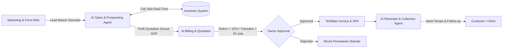

# PEMETAAN PROSES BISNIS PERUSAHAAN (COMPANY PROCESS MAP)
## PT / CV ISKOM — Solusi Rental Laptop, Komputer & IT Equipment

Dokumen ini memetakan alur operasional aktual di ISKOM berdasarkan 8 divisi utama. Pemetaan ini menjadi landasan utama penentuan agent, wewenang, dan integrasi tools AI.

---

## 1. Tabel Pemetaan Divisi & Alur Kerja

| No | Divisi | Jabatan Terkait | Pekerjaan Utama | Input Pekerjaan | Output Pekerjaan | Tools yang Digunakan | Data yang Dibutuhkan | Pelaksana | Approval | Kendala & Masalah Saat Ini |
| :--- | :--- | :--- | :--- | :--- | :--- | :--- | :--- | :--- | :--- | :--- |
| **1** | **Marketing** | Digital Marketer, Content Creator | Akuisisi prospek, iklan Meta/Google Ads, konten edukasi sewa laptop, broadcast promo. | Brief produk, promo sewa bulanan, target market (B2B/B2C). | Lead baru (nama, WA, instansi, kebutuhan unit). | Meta Ads, WhatsApp Blast, Form Sewa Web. | Data portofolio sewa, testimoni, pricelist sewa. | Tim Marketing | Supervisor Marketing | Lead masuk sering lambat direspon saat malam/akhir pekan. |
| **2** | **Sales** | Account Executive, Sales Representative | Kualifikasi kebutuhan, kalkulasi durasi & tipe unit, negosiasi harga, pembuatan Quotation. | Data lead, jumlah unit, durasi sewa (harian/mingguan/bulanan), lokasi. | Draft Penawaran (*Quotation*), status pipeline deal. | HRIS Module Rental, Excel Calculator, WhatsApp. | Spesifikasi laptop (Core i5/i7, RAM, SSD), tarif sewa, margin profit. | Sales Officer | Manager Sales / Owner (bila diskon > 10%) | Sering bolak-balik tanya stok ke tim gudang; kalkulasi diskon tidak konsisten. |
| **3** | **Customer Service** | CS Inbound / Helpdesk | Melayani pertanyaan awal, info syarat jaminan (KTP/PT), penanganan komplain unit bermasalah. | Chat WhatsApp/telepon, pertanyaan calon penyewa, tiket keluhan. | Jawaban FAQ, tiket komplain, verifikasi dokumen KTP/NPWP. | WhatsApp Business, HRIS Ticketing. | SOP syarat jaminan sewa (pribadi vs perusahaan), daftar FAQ umum. | CS Agent / Staf CS | CS Lead | Menjawab pertanyaan berulang tentang syarat jaminan sewa; penanganan komplain lambat. |
| **4** | **Operasional Rental** | Ops Coordinator, Teknisi, Kurir | QC unit sebelum kirim (install OS/aplikasi), packing, serah terima unit (SPK/BAST), penjemputan unit selesai sewa. | Surat Perintah Kerja (SPK), daftar serial number unit, jadwal kirim. | BAST fisik/digital, unit terkirim & terpasang di lokasi klien. | HRIS Delivery, GPS Tracking, Checklist QC Fisik. | Alamat pengiriman, kontak PIC penerima, daftar kelengkapan (charger, tas, mouse). | Teknisi & Kurir | Ops Manager | Jadwal pengembalian sering lewat tanggal tanpa notifikasi otomatis ke tim lapangan. |
| **5** | **Inventory** | Gudang & Asset Manager | Monitoring ketersediaan laptop, status unit (ready, terpakai, servis, rusak), alokasi stok. | Permintaan unit dari Sales, unit kembali dari penyewa. | Status update stok unit, jadwal servis berkala. | HRIS Inventory, Barcode Scanner. | Serial Number, spek unit, riwayat servis, lokasi rak penyimpanan. | Admin Gudang | Ops Manager | Kesalahan data stok fisik vs sistem jika unit baru kembali belum di-input. |
| **6** | **Finance** | Finance & Accounting, Billing | Pembuatan Invoice sewa, penagihan deposit (KTP/standar), verifikasi bukti transfer, penagihan pelunasan (*collection*). | Quotation disetujui, BAST serah terima, bukti pembayaran klien. | Invoice resmi, kuitansi penerimaan deposit, laporan piutang. | HRIS Invoicing, Internet Banking, Excel Ledger. | No rekening klien, nominal deposit, termin pembayaran (DP vs Full). | Staf Finance | Finance Manager / Owner | Follow-up invoice jatuh tempo memakan waktu manual; rekonsiliasi pembayaran deposit rentan selisih. |
| **7** | **HR** | HR & General Affairs | Absensi teknisi/staf, perhitungan komisi sales rental, penilaian KPI performa tim. | Log absensi My-ISN, data closing sales. | Rekap gaji, surat penugasan kurir. | HRIS Payroll & Attendance. | Data karyawan, shift kerja, target sewa bulanan. | HR Officer | HR Manager / Direksi | Penilaian KPI response time sales/CS masih dilakukan secara manual. |
| **8** | **Management** | Direktur / Owner | Evaluasi omset rental, otorisasi diskon besar, persetujuan pengadaan laptop baru, mitigasi risiko unit hilang/rusak. | Rekap mingguan/bulanan, request approval diskon/transaksi bernilai tinggi. | Keputusan Approve/Reject, penetapan target & strategi ekspansi. | Executive Dashboard HRIS, Notifikasi WA/App. | P&L bulanan, tingkat okupansi unit (% laptop tersewa vs idle). | Owner / Direksi | Owner | Terlalu banyak notifikasi mikro yang mengalihkan perhatian dari keputusan strategis. |

---

## 2. Peta Titik Integrasi Otomasi AI (Automation Leverage Points)

