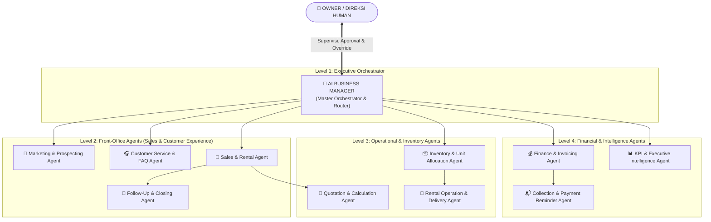

# STRUKTUR ORGANISASI AI (AI ORGANIZATION CHART)
## ISKOM AI Operating System & Autonomous Agents

Dokumen ini mendefinisikan hirarki dan rantai komando multi-agent pada sistem AI ISKOM. Setiap agent memiliki domain tanggung jawab yang spesifik, tidak saling tumpang tindih, dan diorkestrasi oleh **AI Business Manager**.

---

## 1. Diagram Struktur Organisasi AI

---

## 2. Rincian Peran & Tugas Pokok Agent

### 2.1 Level 1: Orchestration & Master Router
- **`AI Business Manager` (Master Agent)**:
  - Menerima semua instruksi dari pengguna.
  - Menguraikan kalimat ke dalam *Intent* dan mendelegasikannya ke agent spesialis terkait.
  - Memastikan tidak ada benturan data antar agent dan memantau status persetujuan Owner.

### 2.2 Level 2: Front-Office Agents
- **`Marketing & Prospecting Agent`**:
  - Mengambil data leads baru dari formulir online, mengklasifikasi kategori pelanggan (Individu vs Perusahaan/B2B).
- **`Customer Service & FAQ Agent`**:
  - Menjawab pertanyaan syarat sewa, jaminan KTP/NPWP, ketersediaan unit umum, dan penanganan keluhan teknis ringan.
- **`Sales & Rental Agent`**:
  - Mengidentifikasi kebutuhan spek laptop (jumlah, durasi, budget), merekomendasikan tipe unit, dan mengoordinasikan penawaran.
- **`Follow-Up & Closing Agent`**:
  - Memantau penawaran yang sudah dikirim ke klien, mengirimkan pesan pengingat sopan sesuai jadwal SOP jika belum ada respon.

### 2.3 Level 3: Middle-Office & Operational
- **`Quotation & Calculation Agent`**:
  - Menghitung tarif sewa resmi berdasarkan durasi sewa, diskon kuantitas, deposit jaminan, dan biaya antar-jemput.
- **`Inventory & Unit Allocation Agent`**:
  - Memeriksa stok laptop fisik di sistem HRIS, memesan alokasi unit (*hold stock*) saat deal terkonfirmasi, dan memantau unit yang masuk servis.
- **`Rental Operation & Delivery Agent`**:
  - Menyiapkan draf Surat Perintah Kerja (SPK) untuk teknisi kurir dan memonitor jadwal serah terima barang di lokasi klien.

### 2.4 Level 4: Finance & Executive Intelligence
- **`Finance & Invoicing Agent`**:
  - Menerbitkan Invoice sewa dan tanda terima deposit, memverifikasi status pembayaran di sistem HRIS.
- **`Collection & Reminder Agent`**:
  - Mengirimkan pengingat jatuh tempo pembayaran H-3, H-1, dan hari H via WhatsApp/Email secara terjadwal.
- **`KPI & Executive Intelligence Agent`**:
  - Menyusun rangkuman harian/mingguan untuk Owner: total omset sewa baru, tingkat keterisian laptop (*utilization rate*), dan durasi respon tim.
