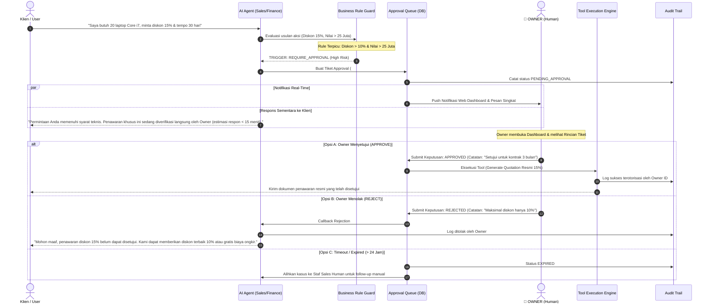

# MATRIKS HAK AKSES & ALUR PERSETUJUAN (PERMISSION MATRIX & APPROVAL FLOW)
## Deliverable Day 5 — Role-Based Access Control & Human-in-the-Loop Engine ISKOM

Dokumen ini memuat standar keamanan otoritas data (**Permission Matrix**) dan arsitektur pengawasan manusia (**Approval Flow**) untuk menjamin tidak ada agen AI yang dapat melakukan aksi transaksi berisiko tinggi tanpa persetujuan bertingkat dari manajemen atau Owner.

---

## 1. Matriks Hak Akses Agen & Pengguna (Permission Matrix)

Hak akses didefinisikan secara granular terhadap setiap entitas data bisnis di ekosistem ISKOM:
- **Read (R)**: Hanya membaca/mencari data.
- **Write (W)**: Membuat data draf baru.
- **Update (U)**: Mengubah status record yang sudah ada.
- **Delete (D)**: Menghapus data (*Agen AI dilarang keras memiliki hak delete fisik*).
- **Execute (X)**: Menjalankan fungsi/tool API atau kode OpenCode.
- **Approval (A)**: Otoritas memberikan persetujuan (`None`, `Limited`, `Full / Yes`).

### 1.1 Tabel Matriks Hak Akses Agen AI

| Kode Agen | Nama Agen | Leads & CRM | Katalog & Aset | Quotation | Invoice & Kas | Tiket & Komplain | Log & Konfigurasi | Wewenang Approval |
| :--- | :--- | :---: | :---: | :---: | :---: | :---: | :---: | :---: |
| `AGENT-MGR-01` | **AI Business Manager** | R | R | R | R | R | R, W (Session Log) | **None** (Orchestrator) |
| `AGENT-SLS-01` | **Sales & Rental** | R, W, U | R | R, W (Draft) | R (Status Saja) | - | R (SOP) | **Limited** (Diskon $\le 10\%$) |
| `AGENT-FLP-01` | **Follow-Up & Closing** | R, U (Status) | - | R | - | - | - | **None** |
| `AGENT-CS-01` | **CS & FAQ** | R (Profil) | R (Katalog) | - | - | R, W (Tiket) | R (FAQ) | **None** |
| `AGENT-INV-01` | **Inventory & Stock** | - | R, U (Hold/Release) | R (Qty Saja) | - | - | - | **Limited** (Hold unit 24 jam) |
| `AGENT-QTC-01` | **Quotation Engine** | R | R (Pricelist) | R, W, U | - | - | - | **None** (Alat kalkulasi) |
| `AGENT-OPS-01` | **Rental Operation** | R (Alamat) | R (No Seri) | R | - | R | - | **None** (Logistik) |
| `AGENT-FIN-01` | **Finance & Billing** | - | - | R (Final) | R, W (Invoice) | - | - | **Limited** (Penerbitan Invoice) |
| `AGENT-COL-01` | **Collection Agent** | R (Kontak) | - | - | R (Piutang) | - | - | **Limited** (Kalkulasi denda) |
| `AGENT-KPI-01` | **KPI & Executive** | R (Agregat) | R (Agregat) | R (Agregat) | R (Agregat) | R (Agregat) | R (All Audit Logs) | **None** (Hanya Laporan) |

---

### 1.2 Tabel Matriks Perbandingan Peran Manusia vs AI

| Peran (Role) | Entitas yang Dapat Dikelola | Wewenang Eksekusi Transaksi | Otoritas Approval Akhir |
| :--- | :--- | :--- | :---: |
| **Owner / Direktur** | **ALL DATA (Akses Penuh Tanpa Batas)** | Eksekusi seluruh tindakan | **YES (Hak Veto Mutlak)** |
| **Finance Manager** | Invoices, Payments, Refunds, Tax | Otorisasi pencatatan kas & pelunasan | **Limited** (Refund & invoice) |
| **Ops Manager** | Asset Laptop, QC, SPK, Maintenance | Penugasan kurir & alokasi armada | **Limited** (Aset & servis) |
| **Sales Staff** | Leads, Follow-up, Negosiasi manual | Pengajuan diskon & penawaran | **No** (Eskalasi ke Manager) |
| **AI Agents** | Akses terbatas via API Tool Registry | Hanya aksi berizin standar | **Strictly Limited by Rule** |

---

## 2. Arsitektur Alur Persetujuan (Approval Flow Architecture)

Alur persetujuan mengadopsi mekanisme **Human-in-the-Loop (HITL)**: tindakan berisiko tinggi akan dibekukan ke dalam antrean (*approval queue*) sampai Owner memberikan otorisasi secara sadar.



---

## 3. Struktur Data Tiket Persetujuan (`Approval Request Schema`)

Setiap tindakan yang ditangguhkan akan disimpan ke tabel database dengan struktur data JSON berikut:

```json
{
  "approval_id": "APV-2026-0042",
  "created_at": "2026-10-07T10:50:00Z",
  "requester_agent": "AGENT-SLS-01",
  "trigger_rule_id": "RULE-DISC-02",
  "category": "DISCOUNT_REQUEST",
  "priority": "HIGH",
  "payload": {
    "customer_name": "PT Sinergi Digital",
    "customer_phone": "081234567890",
    "requested_units": 20,
    "unit_model": "Lenovo ThinkPad Core i7",
    "rental_duration_days": 30,
    "normal_price_idr": 28000000,
    "requested_discount_percent": 15.0,
    "final_proposed_price_idr": 23800000,
    "profit_margin_estimated_percent": 34.5
  },
  "rationale_by_agent": "Klien memesan kuantitas besar (20 unit) dengan potensi perpanjangan kontrak 6 bulan ke depan.",
  "status": "PENDING",
  "decision": {
    "decided_by_user_id": null,
    "decision_time": null,
    "verdict": null,
    "notes": null
  },
  "sla_expires_at": "2026-10-08T10:50:00Z"
}
```

---

## 4. Tingkatan Eskalasi & SLA Penanganan (Approval SLA)

| Tingkat Urgensi | Kriteria Pemicu | Target Respon Owner | Fallback Jika Melewati Batas Waktu |
| :--- | :--- | :---: | :--- |
| **URGENT** | Transaksi bernilai $>$ Rp 50 Juta ATAU stok kritis | $\le 15$ Menit | Pengingat kedua via WhatsApp darurat |
| **HIGH** | Diskon $10\% - 20\%$ ATAU unit $\ge 20$ unit | $\le 1$ Jam | Penugasan manual ke Sales Manager |
| **MEDIUM** | Pengajuan refund deposit jaminan sewa | $\le 4$ Jam | Ditahan hingga jam kerja operasional finance |
| **LOW** | Koreksi data administratif non-finansial | $\le 24$ Jam | Auto-reject dengan catatan batas waktu habis |

---

## 5. Mekanisme Keamanan Intersepsi (RBAC Guard Middleware)

Pada implementasi kode di Minggu 2, setiap fungsi tool akan dilindungi oleh *decorator* Python / middleware:

```python
# Contoh implementasi Guard pada Tool Registry
@require_permission(agent_id="AGENT-SLS-01", action="create_quotation")
@evaluate_rule_engine(rules=["RULE-DISC-01", "RULE-HVT-01"])
async def create_rental_quotation(customer_id: int, items: list, discount_percent: float):
    # Jika diskon > 10% atau nilai >= 25 jt,
    # decorator otomatis menghentikan eksekusi dan mengembalikan status:
    # {"status": "PENDING_APPROVAL", "ticket_id": "APV-XXXX"}
    pass
```
