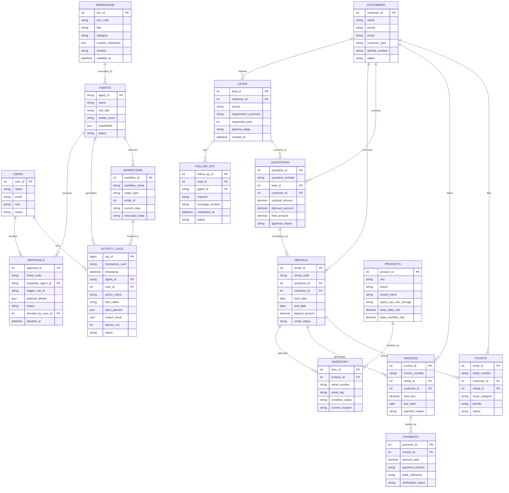

# ARSITEKTUR DATABASE & ERD (DATABASE SCHEMA & ERD)
## Deliverable Day 6 — Data Architecture & Entity Relationship Diagram ISKOM

Dokumen ini mendefinisikan arsitektur basis data, rancangan skema 16 entitas inti, dan relasi antar tabel (*Entity Relationship Diagram*) untuk mendukung operasional sistem multi-agent ISKOM AI-OS.

---

## 1. Arsitektur Basis Data (Dual-Layer Data Architecture)

Sistem menggunakan pendekatan **Dual-Layer Database**:
1. **Business & Transactional Layer (HRIS MySQL Database)**:
   - Menyimpan data operasional bisnis riil: Pelanggan, Aset Laptop, Kontrak Sewa, Quotation, Invoice, dan Pembayaran yang terintegrasi dengan ERP HRIS.
2. **AI-OS Governance & State Layer (Dedicated AI Core Database)**:
   - Menyimpan status internal agen: Konfigurasi Agen, Workflow State, Antrean Approval Human-in-the-Loop, Knowledge Base, dan Activity Audit Logs.

---

## 2. Diagram Hubungan Entitas (Entity Relationship Diagram - Mermaid)

---

## 3. Rincian Kamus Data (16 Entitas Wajib)

### 3.1 Entitas Pengguna & Agen
1. **`users`**: Data pengguna sistem (Owner, Direksi, Sales Staf, Teknisi).
   - Kolom: `user_id` (PK), `name`, `email`, `password_hash`, `role` (`OWNER`, `MANAGER`, `STAFF`), `phone`, `status`, `created_at`.
2. **`agents`**: Registrasi identitas agen AI.
   - Kolom: `agent_id` (PK, misal `AGENT-SLS-01`), `name`, `role_title`, `model_name` (`hermes-3`), `temperature`, `capabilities` (JSON), `status` (`ACTIVE`, `PAUSED`).

### 3.2 Entitas Prospek & Pelanggan
3. **`customers`**: Data profil penyewa laptop (Perorangan / Perusahaan B2B).
   - Kolom: `customer_id` (PK), `name`, `phone`, `email`, `customer_type` (`INDIVIDUAL`, `CORPORATE`), `identity_number` (KTP/NPWP), `address`, `status`.
4. **`leads`**: Pipeline prospek awal dari form web / chat WA.
   - Kolom: `lead_id` (PK), `customer_id` (FK), `source` (`WEB_FORM`, `WHATSAPP`, `ADS`), `requirement_summary`, `requested_units`, `pipeline_stage` (`NEW`, `QUALIFIED`, `NEGOTIATION`, `WON`, `LOST`), `created_at`.
5. **`follow_ups`**: Riwayat dan jadwal sentuhan otomatis kepada prospek.
   - Kolom: `follow_up_id` (PK), `lead_id` (FK), `agent_id` (FK), `channel` (`WHATSAPP`, `EMAIL`), `message_content`, `scheduled_at`, `status` (`PENDING`, `SENT`, `FAILED`).

### 3.3 Entitas Produk, Aset & Inventaris
6. **`products`**: Katalog tipe & spesifikasi laptop/IT.
   - Kolom: `product_id` (PK), `sku`, `brand`, `model_name`, `specs_cpu_ram_storage`, `base_daily_rate`, `base_monthly_rate`, `min_deposit_idr`.
7. **`inventory`**: Data unit fisik individual (berdasarkan Serial Number).
   - Kolom: `item_id` (PK), `product_id` (FK), `serial_number`, `asset_tag`, `condition_status` (`READY_IN_WAREHOUSE`, `BOOKED`, `RENTED`, `MAINTENANCE`, `RETIRED`), `current_location`, `last_qc_date`.

### 3.4 Entitas Transaksi Sewa & Penawaran
8. **`quotations`**: Draf dan dokumen resmi penawaran harga sewa.
   - Kolom: `quotation_id` (PK), `quotation_number`, `lead_id` (FK), `customer_id` (FK), `subtotal_amount`, `discount_percent`, `discount_amount`, `final_amount`, `approval_id` (FK), `approval_status` (`DRAFT`, `PENDING_APPROVAL`, `APPROVED`, `REJECTED`).
9. **`rentals`**: Surat Perjanjian / Kontrak Sewa aktif.
   - Kolom: `rental_id` (PK), `rental_code`, `quotation_id` (FK), `customer_id` (FK), `start_date`, `end_date`, `duration_days`, `deposit_amount`, `rental_status` (`ACTIVE`, `EXTENDED`, `COMPLETED`, `OVERDUE`).

### 3.5 Entitas Keuangan & Tagihan
10. **`invoices`**: Lembar tagihan biaya sewa & deposit.
    - Kolom: `invoice_id` (PK), `invoice_number`, `rental_id` (FK), `customer_id` (FK), `subtotal`, `tax_ppn`, `total_due`, `due_date`, `payment_status` (`UNPAID`, `PARTIAL`, `PAID`, `OVERDUE`).
11. **`payments`**: Catatan pembayaran dan mutasi kas bank.
    - Kolom: `payment_id` (PK), `invoice_id` (FK), `amount_paid`, `payment_method` (`BANK_TRANSFER`, `CASH`, `PAYMENT_GATEWAY`), `bank_reference`, `proof_file_path`, `verification_status` (`PENDING`, `VERIFIED`, `REJECTED`).

### 3.6 Entitas Layanan & Bantuan
12. **`tickets`**: Keluhan teknis unit laptop selama masa sewa.
    - Kolom: `ticket_id` (PK), `ticket_number`, `customer_id` (FK), `rental_id` (FK), `item_id` (FK), `issue_category` (`HARDWARE`, `SOFTWARE`, `BATTERY`, `ACCESSORY`), `priority` (`LOW`, `MEDIUM`, `HIGH`, `URGENT`), `status` (`OPEN`, `IN_PROGRESS`, `RESOLVED`, `CLOSED`).

### 3.7 Entitas Engine AI & Pengawasan (AI Governance)
13. **`workflows`**: Mesin pelacak tahapan proses otonom.
    - Kolom: `workflow_id` (PK), `workflow_name`, `entity_type` (`LEAD`, `RENTAL`, `TICKET`), `entity_id`, `current_step`, `execution_state` (`RUNNING`, `WAITING_APPROVAL`, `COMPLETED`, `FAILED`), `updated_at`.
14. **`approvals`**: Antrean persetujuan transaksi berisiko tinggi oleh Owner.
    - Kolom: `approval_id` (PK), `ticket_code`, `requester_agent_id` (FK), `trigger_rule_id`, `category` (`DISCOUNT`, `REFUND`, `HIGH_VALUE`), `payload_details` (JSON), `status` (`PENDING`, `APPROVED`, `REJECTED`, `EXPIRED`), `decided_by_user_id` (FK), `decision_notes`, `created_at`, `decided_at`.
15. **`knowledge`**: Repositori SOP, kebijakan harga, dan aturan sewa.
    - Kolom: `doc_id` (PK), `doc_code`, `title`, `category` (`SOP`, `FAQ`, `POLICY`, `PRICING`), `content_markdown`, `version`, `is_active`, `updated_at`.
16. **`activity_logs`**: Audit trail komprehensif setiap detik aktivitas AI.
    - Kolom: `log_id` (PK, BigInt), `transaction_uuid`, `timestamp`, `agent_id` (FK), `user_id` (FK), `action_name`, `tool_called`, `input_params` (JSON), `output_result` (JSON), `error_message`, `latency_ms`, `tokens_used`, `status` (`SUCCESS`, `BLOCKED_BY_RULE`, `FAILED`).
