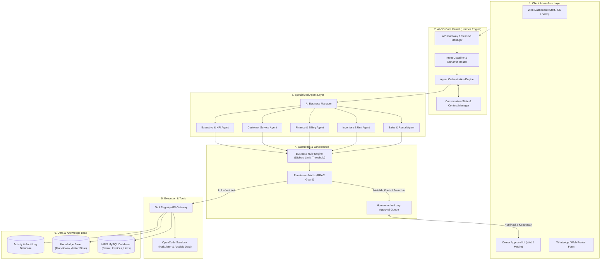
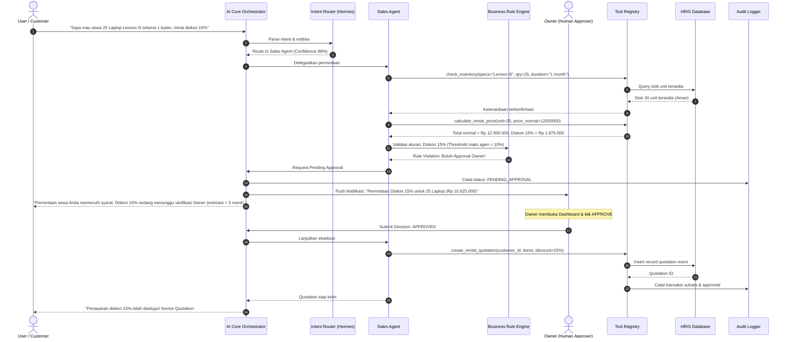
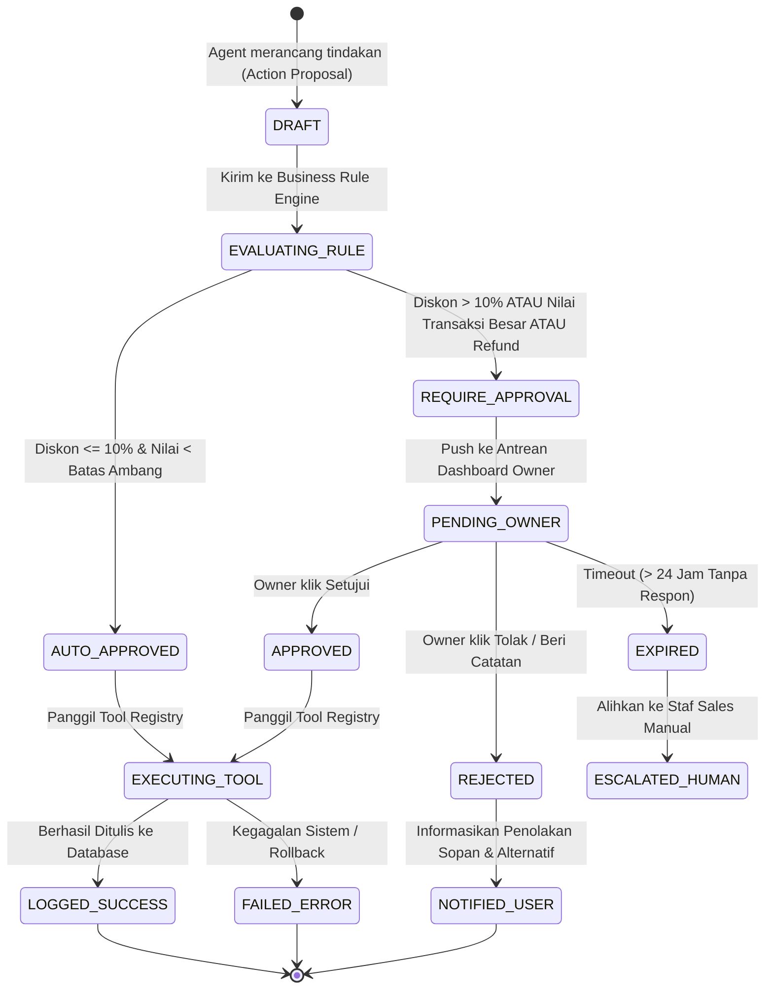
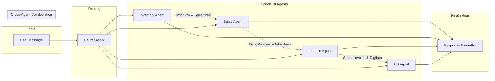

# ARSITEKTUR SISTEM & DIAGRAM ALUR (FLOWCHART MERMAID)
## ISKOM AI Operating System & Multi-Agent Dashboard

Dokumen ini memuat representasi visual arsitektur perangkat lunak, siklus hidup eksekusi instruksi, rantai *Human-in-the-Loop Approval*, dan *State Machine Workflow*.

---

## 1. Arsitektur Tingkat Tinggi (High-Level Architecture)

---

## 2. Diagram Urutan Eksekusi (Sequence Diagram: Request to Result)

Diagram ini mengilustrasikan alur pemrosesan saat pengguna meminta penawaran harga dengan permintaan diskon khusus:

---

## 3. Diagram Status Persetujuan (Approval State Machine)

Setiap aksi transaksi yang memerlukan campur tangan manusia (*Human-in-the-Loop*) melewati state machine berikut:

---

## 4. Matriks Kolaborasi Antar Agen (Multi-Agent Swarm Flow)

